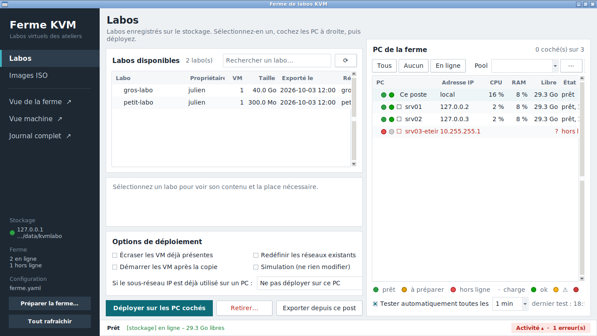
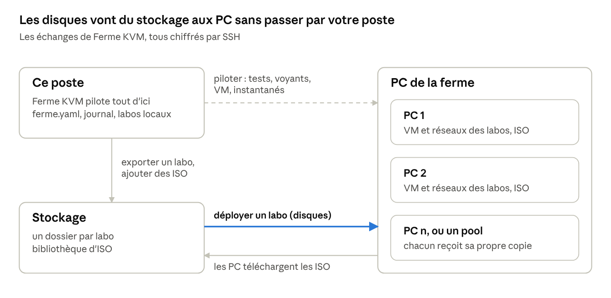
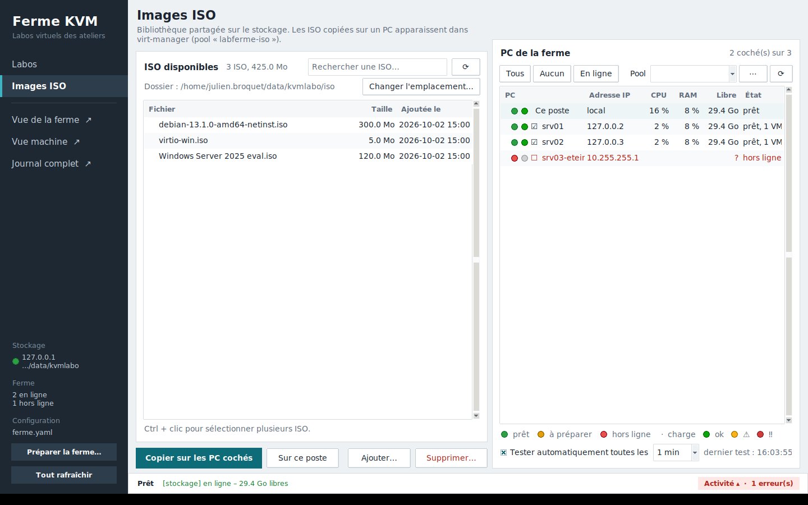
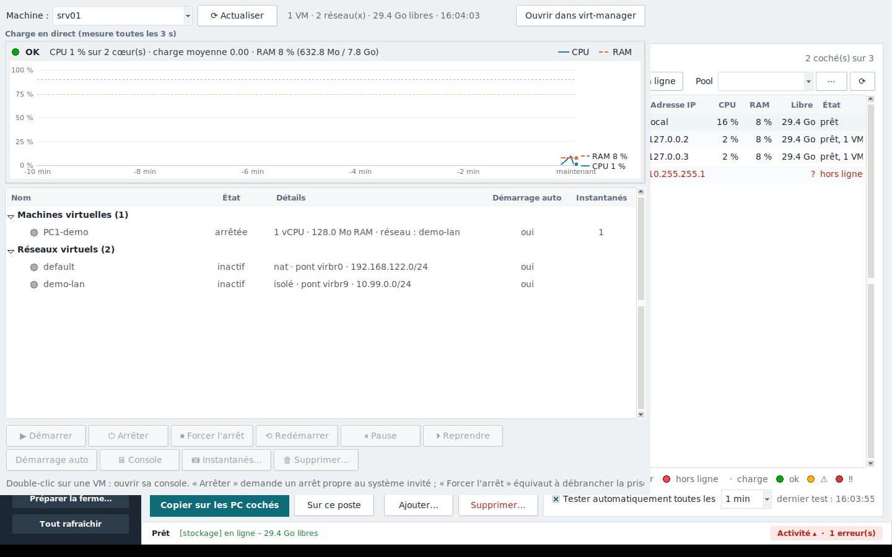

# Ferme KVM

Ferme KVM sauvegarde les labos virtuels (réseaux + VM) d'un poste sur un serveur de stockage, puis les déploie sur les PC d'une ferme Debian/KVM : sur toute la ferme, sur un pool ou sur quelques PC choisis. Conçu pour les ateliers des apprentis CFC, où plusieurs enseignants partagent la même ferme avec chacun leurs labos.

**Version 1.0.0** (2026-10-03) · Python 3 · Tkinter · libvirt · SSH + rsync



## Comment ça marche



Le poste pilote tout, le stockage garde les labos et les ISO, et chaque PC reçoit ses disques directement du stockage : déployer sur 20 PC ne charge pas votre poste.

Un **labo** = un ou plusieurs réseaux virtuels libvirt + toutes les VM qui y sont branchées. Sur le stockage, chaque labo est un dossier :

```
<chemin>/<labo>/labo.json          manifeste (propriétaire, réseaux, VM, disques)
<chemin>/<labo>/xml/               définitions des réseaux et des VM
<chemin>/<labo>/disques/           disques (qcow2/raw) et NVRAM UEFI
```

## Installation

Le programme tourne sur le poste de l'enseignant ; rien n'est installé à la main sur les PC de la ferme.

| Machine | Prérequis |
| --- | --- |
| Poste | Debian ou Ubuntu, Python 3.9+, `python3-tk python3-paramiko python3-yaml rsync` ; `virt-viewer` pour ouvrir l'écran des VM |
| PC de la ferme | Debian avec KVM, libvirt, serveur SSH actif, IP fixe, un compte (sudoer ou non) |
| Stockage | Linux (Debian, NAS Synology…) avec SSH, rsync et un compte qui possède le dossier des labos |

```bash
sudo apt install python3-tk python3-paramiko python3-yaml rsync virt-viewer
git clone <ce dépôt> ferme-kvm && cd ferme-kvm
cp ferme.exemple.yaml ferme.yaml      # puis adapter (voir Configuration)
chmod 600 ferme.yaml                  # contient des mots de passe
python3 labferme_gui.py               # ou : python3 labferme_gui.py -c autre.yaml
```

`ferme.yaml` est exclu du dépôt par `.gitignore` : ne le publiez jamais.

## Configuration

Toute la ferme est décrite dans `ferme.yaml` : le stockage, les valeurs communes, puis un bloc par PC. Les mots de passe ne servent qu'à la préparation ; ensuite tout passe par clés SSH.

```yaml
stockage:
  ip: 192.168.100.10
  utilisateur: enseignant
  mot_de_passe: "..."
  chemin: /volume1/homes/enseignant/Data/kvmlabo
  chemin_iso: /volume1/homes/enseignant/Data/kvmlabo/iso

defaut:
  utilisateur: administrateur
  mot_de_passe: "..."
  images: /var/lib/libvirt/images/labos
  isos: /var/lib/libvirt/images/iso

hotes:
  - nom: KVM-01
    ip: 192.168.100.11
    pools: [atelier-reseau, salle-a]
```

| Clé | Rôle |
| --- | --- |
| `stockage.chemin` | Dossier des labos sauvegardés (un sous-dossier par labo) |
| `stockage.chemin_iso` | Dossier des ISO ; modifiable depuis l'interface |
| `defaut.*` | Valeurs prises par tous les PC, surchargeables PC par PC |
| `images` | Où les disques des labos sont copiés sur chaque PC |
| `isos` | Où les ISO sont copiées sur chaque PC |
| `pools` | Groupes de PC ; se gèrent aussi depuis l'interface |
| `mot_de_passe_root` | Facultatif, pour un compte non sudoer ; sinon l'interface le demande |

L'interface réécrit `ferme.yaml` quand on enregistre un pool ou un emplacement d'ISO : les commentaires ajoutés à la main disparaissent alors.

## Première mise en route

Trois préparations, une seule fois, puis à chaque nouvelle machine. Aucune ne touche aux VM existantes.

1. **Stockage (NAS Synology)** : dans DSM, activer le service SSH (Terminal et SNMP), le service d'accueil de l'utilisateur, le service rsync (Services de fichiers → rsync) et autoriser l'application rsync pour le compte (Utilisateur et groupe → Applications). Un stockage Debian n'a besoin que de `openssh-server` et `rsync`.
2. **PC de la ferme** : barre latérale → « Préparer la ferme… » (ou clic droit sur un PC → « Préparer ce PC… »). Le programme échange les clés SSH, donne au compte une règle sudo limitée et le met dans les groupes libvirt et kvm. Si le compte n'est pas sudoer, il demande le mot de passe root du PC (utilisé par `su`, jamais enregistré).
3. **Ce poste** : clic droit sur la ligne « Ce poste » → « Préparer ce poste… ». Nécessaire pour exporter un labo et recevoir des ISO.

Vérification : tous les voyants passent au vert, et un clic sur le voyant du stockage (barre latérale) → « Tester l'accès » doit afficher quatre ✔.

Nouvelle machine : l'ajouter dans `ferme.yaml`, « Tout rafraîchir » (F5), puis « Préparer ce PC… » sur sa ligne.

## L'interface

| Zone | Contenu |
| --- | --- |
| Barre latérale (gauche) | Pages Labos et Images ISO ; fenêtres Vue de la ferme, Vue machine, Journal complet (↗) ; état du stockage, résumé de la ferme, fichier de configuration, « Préparer la ferme… », « Tout rafraîchir » |
| Page (centre) | La liste du stockage (labos ou ISO) avec recherche, le détail de l'élément choisi, les options et les boutons d'action |
| PC de la ferme (droite) | Une ligne par PC : deux voyants, case à cocher, IP, CPU, RAM, place libre, état ; Tous / Aucun / En ligne, choix d'un pool, test immédiat |
| Barre d'état (bas) | Opération en cours, dernier message, bouton « Activité » qui ouvre le journal récent et compte les erreurs |

- Clic sur un PC : le cocher. Double-clic : Vue machine. Clic droit : détails, test d'accès au stockage, préparation.
- Le bouton principal de chaque page est en bleu pétrole ; les actions qui suppriment sont en rouge.
- Survoler un bouton ou une option affiche ce qu'il fait.
- Raccourcis : F5 tout rafraîchir, Ctrl+1 Labos, Ctrl+2 ISO, Ctrl+F rechercher, Ctrl+J activité.

## Tâches courantes

### Exporter un labo de ce poste

1. Page Labos → « Exporter depuis ce poste… ».
2. Cocher le ou les réseaux virtuels du labo : toutes les VM branchées dessus sont incluses.
3. Donner un nom (lettres, chiffres, `.` `_` `-`), un propriétaire et une description.
4. Laisser coché « Éteindre proprement les VM allumées » : elles sont relancées après la copie.

Un disque issu d'un instantané est fusionné en un fichier complet (« aplatissement ») ; il faut assez de place dans `/var/tmp` du poste. La liste des instantanés n'est pas exportée.

### Déployer un labo

1. Page Labos : sélectionner le labo. Le détail indique la place nécessaire par PC.
2. À droite : cocher les PC, ou choisir un pool. Un ⚠ dans « Libre » signale un PC trop plein.
3. Options si besoin : écraser les VM existantes, redéfinir les réseaux, démarrer les VM, simulation, et la conduite à tenir si le sous-réseau est déjà pris.
4. « Déployer sur les PC cochés ».

Les disques partent du stockage directement vers chaque PC (4 en parallèle). Si le pont `virbrN` est pris, le suivant libre est utilisé ; les VM sont rebranchées par nom de réseau. Les PC sans assez de place (+ 2 Go de marge) sont exclus.

### Retirer un labo

Sélectionner le labo, cocher les PC, « Retirer… » : VM, disques et réseaux du labo sont supprimés ; un réseau encore utilisé par une autre VM est conservé.

### Images ISO



- « Ajouter… » envoie des `.iso` de ce poste vers le stockage (reprise possible si coupé).
- Sélectionner une ou plusieurs ISO (Ctrl + clic), puis « Copier sur les PC cochés » ou « Sur ce poste ».
- Sur chaque PC, les ISO arrivent dans `/var/lib/libvirt/images/iso` et apparaissent dans virt-manager, pool « labferme-iso ».
- « Changer l'emplacement… » modifie le dossier des ISO sur le stockage.

### Vue de la ferme

Un tableau labos × PC : ✔ complet, ◐ partiel (VM ou réseau manquant), ▶n VM en marche, ✖ PC injoignable. La ligne grise compte les VM et réseaux qui ne viennent d'aucun labo du stockage. Le bouton du bas sélectionne le labo et coche les PC où il est déployé.

### Vue machine et instantanés



Double-clic sur un PC. On y voit la charge CPU et RAM en direct (10 dernières minutes), les VM et les réseaux, et on peut :

- démarrer, arrêter proprement, forcer l'arrêt, redémarrer, mettre en pause, régler le démarrage automatique ;
- ouvrir l'écran d'une VM (🖥 Console ou double-clic), ou tout le PC dans virt-manager ;
- créer, restaurer ou supprimer un instantané (★ = instantané courant) ;
- supprimer une VM avec ses disques.

## Voyants et surveillance

Chaque PC porte deux voyants, testés au démarrage puis toutes les minutes (réglable de 30 s à 5 min, ou désactivable).

| Voyant | Couleur | Signification | Que faire |
| --- | --- | --- | --- |
| 1er : connexion | Vert | Prêt : SSH et droits libvirt complets | Rien |
| 1er : connexion | Orange | Le PC répond mais doit être préparé (droits, clé, mot de passe SSH) | Clic droit → « Préparer ce PC… » |
| 1er : connexion | Rouge | Port SSH 22 injoignable : éteint, débranché ou SSH arrêté | Allumer, vérifier le câble et `systemctl status ssh` |
| 1er : connexion | Gris | Test en cours | Attendre |
| 2e : charge | Vert | CPU et RAM sous 75 % | Rien |
| 2e : charge | Orange ⚠ | Le plus chargé des deux entre 75 et 90 % | Surveiller, éviter d'y déployer |
| 2e : charge | Rouge ‼ | 90 % ou plus | Arrêter des VM ou choisir un autre PC |

Le voyant du stockage (barre latérale) suit la même logique. Les seuils de charge se changent en tête de `labferme.py` (`SEUIL_ATTENTION`, `SEUIL_CRITIQUE`).

## Dépannage

Le détail de chaque erreur est dans le journal : « Journal complet », filtre « Erreurs seulement », ou le fichier `~/.local/state/labferme/labferme.log` (aucun mot de passe n'y est écrit).

| Message ou symptôme | Cause | Solution |
| --- | --- | --- |
| « échec de sudo -n virsh », voyant orange « droits insuffisants » | Le compte n'est ni sudoer ni dans le groupe libvirt | « Préparer ce PC… » avec le mot de passe root |
| « Permission denied, please try again » + « rsync: connection unexpectedly closed » | Le NAS Synology refuse rsync à ce compte | DSM : activer le service rsync et autoriser l'application rsync au compte |
| « Permission denied (publickey…) » | Clé SSH refusée | Relancer « Préparer » ; sur le serveur : `chmod 755 ~ ; chmod 700 ~/.ssh` |
| « Host key verification failed » | Le PC a été réinstallé | `ssh-keygen -R <ip>` et `sudo ssh-keygen -R <ip>` sur le poste et le stockage |
| « impossible de créer /var/lib/libvirt/images/iso » | « Ce poste » n'est pas préparé | Clic droit sur « Ce poste » → « Préparer ce poste… » |
| « le sous-réseau … chevauche un réseau existant » | Le PC utilise déjà cette plage IP | Option « Prendre le sous-réseau libre suivant » ou « Créer le réseau sans IP » |
| « place insuffisante » | Disque du PC trop plein (marge 2 Go) | Retirer d'anciens labos ou choisir un autre PC |
| VM déployée qui ne démarre pas : fichier .qcow2 introuvable | Labo déployé avant la version 1.0 depuis une VM avec instantané | Redéployer avec « Écraser les VM déjà présentes » |
| Console qui ne s'ouvre pas | virt-viewer absent, ou compte du PC hors du groupe libvirt | `sudo apt install virt-viewer` ; relancer « Préparer ce PC… » |
| Instantané refusé sur une VM allumée | VM en UEFI | Éteindre la VM avant l'instantané |
| Labo « ◐ 0/1 » dans la Vue de la ferme | Déploiement interrompu | Redéployer avec « Écraser », ou retirer le labo de ce PC |

Pour tester d'un coup tout le chemin d'un PC vers le stockage : clic droit → « Tester l'accès au stockage » (clé, connexion, rsync, rsync via sudo).

## Sécurité

Chaque machine crée sa propre clé `~/.ssh/labferme` ; seules les clés publiques sont copiées dans `~/.ssh/authorized_keys` des autres machines, et les clés privées ne quittent jamais leur machine.

| Clé publique de… | Ajoutée sur… | Sert à… |
| --- | --- | --- |
| Ce poste (`labferme-poste-<compte>-<machine>`) | Stockage et PC de la ferme | Piloter la ferme, exporter, recevoir des ISO |
| Chaque PC (`labferme-<nom>`) | Stockage | Sauvegarder vers le stockage, télécharger les ISO |
| Stockage (`labferme-stockage`) | Chaque PC | Envoyer les disques lors d'un déploiement |

- Droits donnés sur un PC : une règle `/etc/sudoers.d/labferme-<compte>` limitée à `virsh`, `rsync`, `qemu-img`, `mkdir` et `rm`, plus les groupes libvirt et kvm.
- Les clés n'ont pas de phrase de passe (les transferts se font sans intervention) : ne pas donner aux apprentis le compte utilisé par la ferme.
- Le mot de passe root n'est jamais enregistré s'il est saisi dans l'interface ; `ferme.yaml` doit rester en `chmod 600` et hors du dépôt.

**Révoquer une machine**, par exemple srv05 :

1. Sur le stockage : `sed -i '/labferme-srv05/d' ~/.ssh/authorized_keys`.
2. Retirer son bloc de `ferme.yaml`, puis « Tout rafraîchir ».
3. Si elle reste en service : sur srv05, supprimer `~/.ssh/labferme*`, les lignes `labferme-` de `authorized_keys` et `/etc/sudoers.d/labferme-*`.

## Ligne de commande

Tout ce que fait l'interface existe aussi en commande : `python3 labferme.py [-c ferme.yaml] <commande>`. La sélection des PC se fait avec `--tous`, `--pool NOM` ou `--hote NOM` (répétables).

| Commande | Effet |
| --- | --- |
| `preparer [--local]` | Clés SSH, droits et paquets sur le stockage et les PC |
| `lister -d` | Labos du stockage, avec leurs VM |
| `inventaire` | Réseaux et VM présents sur les PC |
| `sauvegarder -r RESEAU [-n NOM] [--arreter]` | Exporter un labo de ce poste (ou `--hote PC`) |
| `deployer LABO --pool salle-a [--conflit-ip decaler] [--simulation]` | Déployer un labo |
| `retirer LABO --hote srv01` | Retirer un labo |
| `isos` | Lister les ISO du stockage |
| `iso-envoyer FICHIER.iso` | Envoyer une ISO vers le stockage |
| `iso-copier NOM.iso --tous [--local]` | Copier une ISO sur des PC ou sur ce poste |
| `iso-supprimer NOM.iso` | Supprimer une ISO du stockage |
| `--version` | Afficher la version |

## Fichiers

| Fichier | Rôle |
| --- | --- |
| `labferme.py` | Moteur et ligne de commande (SSH, libvirt, rsync) |
| `labferme_gui.py` | Interface graphique (Tkinter), à placer à côté de `labferme.py` |
| `ferme.exemple.yaml` | Exemple de configuration à copier en `ferme.yaml` |
| `CHANGELOG.md` | Historique des versions |

## Versions

Numérotation `majeure.mineure.correctif` : la mineure pour une nouvelle fonction, le correctif pour une correction. La version est définie dans `labferme.py` (`__version__`). Voir [CHANGELOG.md](CHANGELOG.md).
